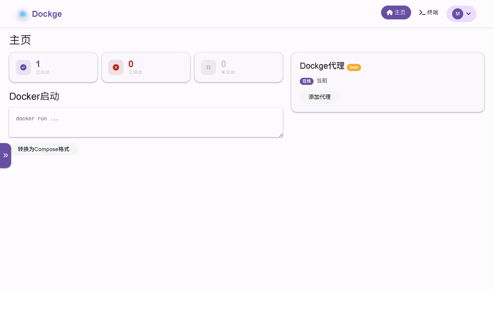
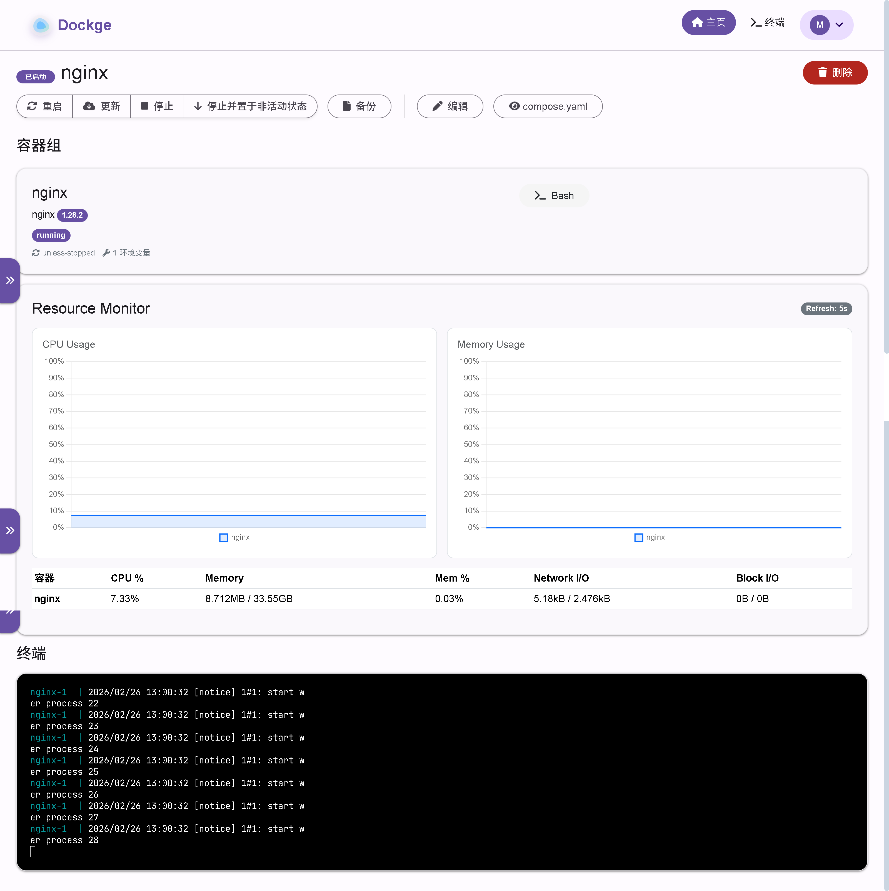
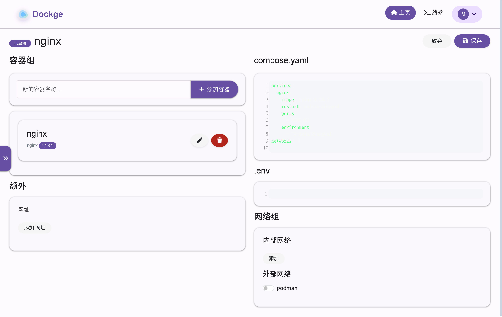
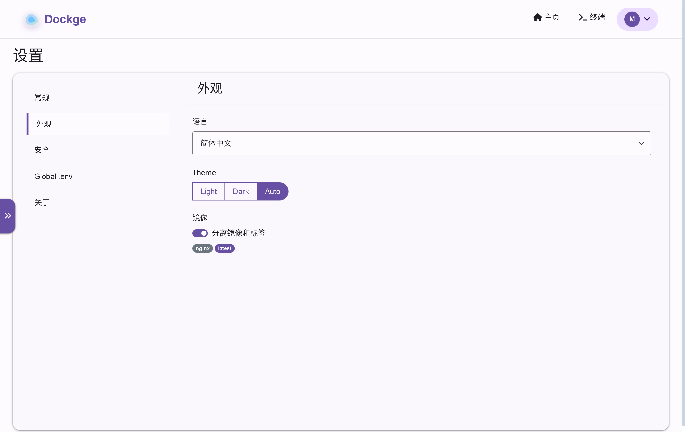
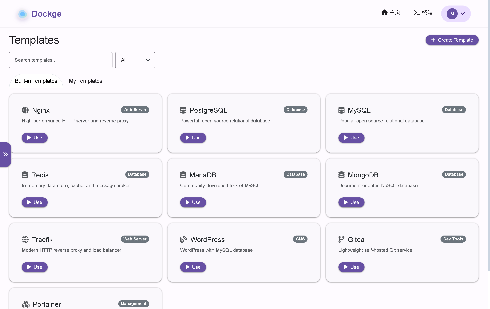
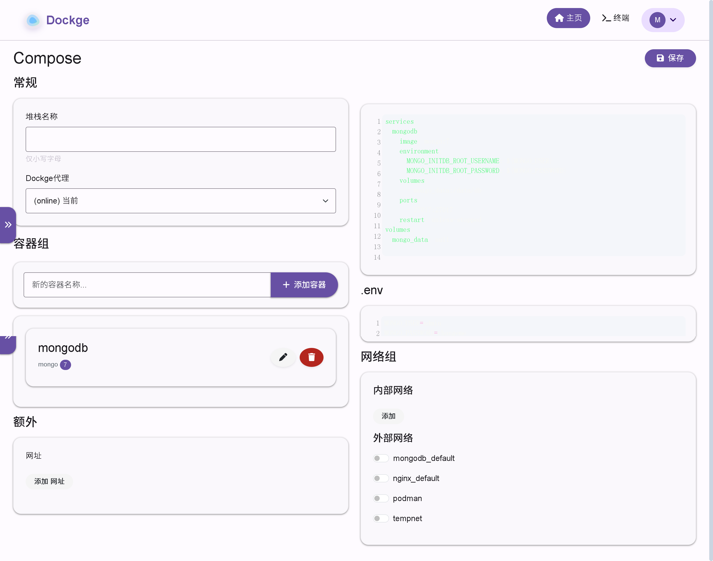
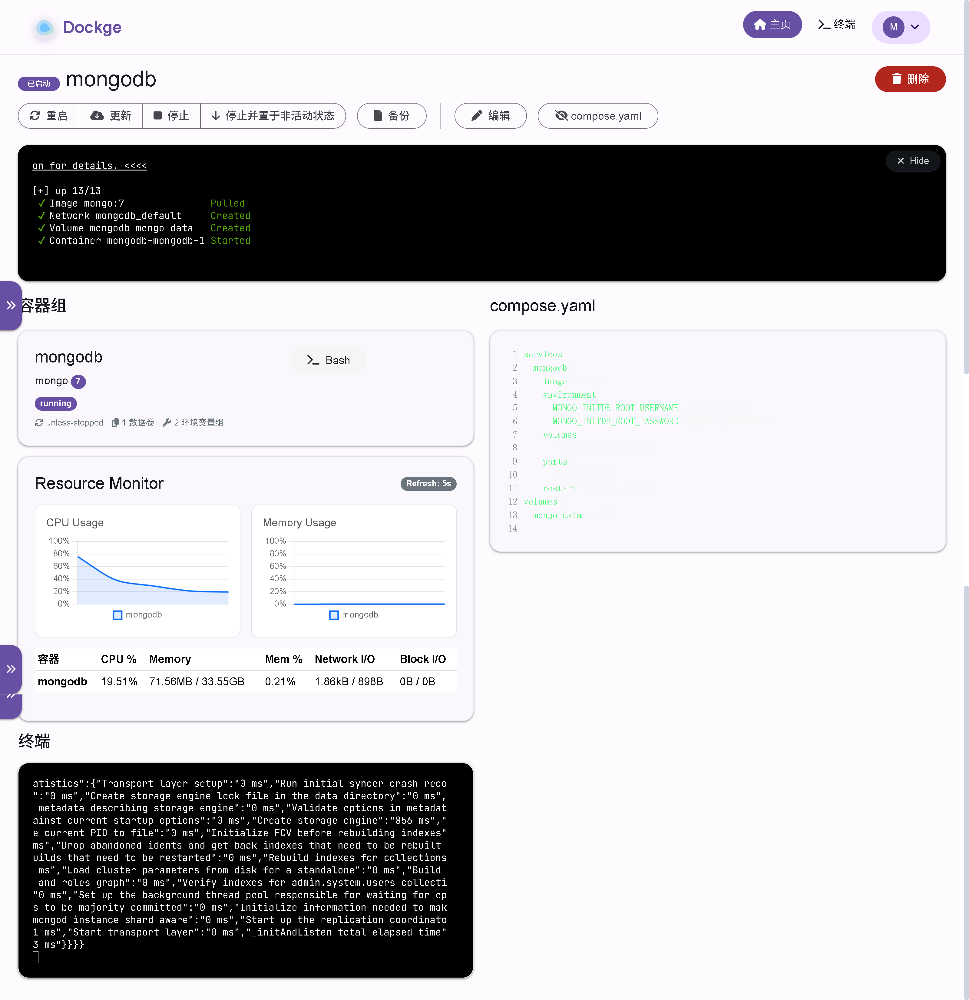
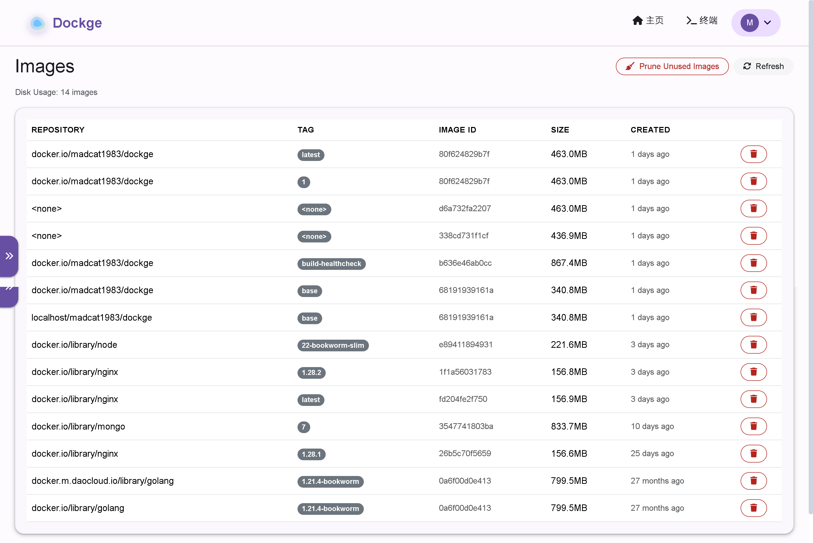
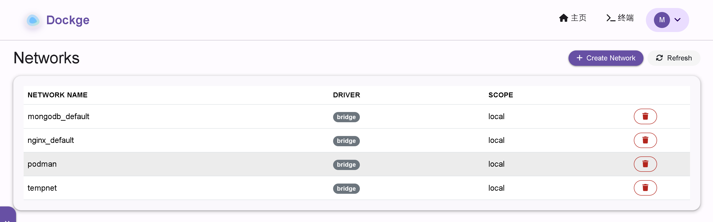

<div align="center" width="100%">
    
</div>

# Dockge

> **Fork Notice**: This is a fork of [louislam/dockge](https://github.com/louislam/dockge), originally created by [Louis Lam](https://github.com/louislam). Licensed under the [MIT License](./LICENSE).

A fancy, easy-to-use and reactive self-hosted docker compose.yaml stack-oriented manager.

[](https://github.com/mayi/dockge) [](https://hub.docker.com/r/madcat1983/dockge/tags) [](https://hub.docker.com/r/madcat1983/dockge/tags) [](https://github.com/mayi/dockge/commits/master/)


## ⭐ Features

- 🧑‍💼 Manage your `compose.yaml` files
  - Create/Edit/Start/Stop/Restart/Delete
  - Update Docker Images
- ⌨️ Interactive Editor for `compose.yaml`
- 🦦 Interactive Web Terminal
- 🕷️ (1.4.0 🆕) Multiple agents support - You can manage multiple stacks from different Docker hosts in one single interface
- 🏪 Convert `docker run ...` commands into `compose.yaml`
- 📙 File based structure - Dockge won't kidnap your compose files, they are stored on your drive as usual. You can interact with them using normal `docker compose` commands


- 🚄 Reactive - Everything is just responsive. Progress (Pull/Up/Down) and terminal output are in real-time
- 🐣 Easy-to-use & fancy UI - If you love Uptime Kuma's UI/UX, you will love this one too

### Fork Enhancements

This fork introduces the following improvements over the original Dockge:

#### Security
- 🔒 **Login Rate Limiting** - Per-IP and global rate limiting on login attempts to prevent brute-force attacks
- 🔑 **Password Strength Requirements** - Enforced minimum password complexity (length, uppercase, lowercase, numbers)
- 🛡️ **Session Management** - Server-side session tracking with the ability to view active sessions and revoke them from Settings
- ✅ **Input Validation Hardening** - Strict validation on all user inputs (stack names, network names, image IDs, etc.)
- 📋 **Audit Log** - Tracks all significant operations (deploy, delete, login, settings changes) with user, IP, and timestamp

#### Feature Enhancements
- 📦 **Stack Templates** - Built-in templates (Nginx, PostgreSQL, MySQL, Redis, MariaDB, MongoDB, Traefik, WordPress, Gitea, Portainer) and custom user-defined templates for quick stack creation
- 🌐 **Docker Network Management** - List, create, and remove Docker networks directly from the UI
- 🖼️ **Image Management** - List, remove, and prune Docker images with size overview
- 📥 **Container Log Export** - Download stack logs as text files via REST API

#### UI/UX
- 📱 **Responsive Layout** - Mobile-optimized bottom navigation with "More" menu, tablet-adapted breakpoints, touch-friendly controls
- ✔️ **Standardized Confirm Dialogs** - Consistent confirmation dialogs across all destructive operations


## 🔧 How to Install

Requirements:
- [Docker](https://docs.docker.com/engine/install/) 20+ / Podman
- (Podman only) podman-docker (Debian: `apt install podman-docker`)
- OS:
  - Major Linux distros that can run Docker/Podman such as:
     - ✅ Ubuntu
     - ✅ Debian (Bullseye or newer)
     - ✅ Raspbian (Bullseye or newer)
     - ✅ CentOS
     - ✅ Fedora
     - ✅ ArchLinux
  - ❌ Debian/Raspbian Buster or lower is not supported
  - ❌ Windows (Will be supported later)
- Arch: armv7, arm64, amd64 (a.k.a x86_64)

### Basic

- Default Stacks Directory: `/opt/stacks`
- Default Port: 5001

```
# Create directories that store your stacks and stores Dockge's stack
mkdir -p /opt/stacks /opt/dockge
cd /opt/dockge

# Download the compose.yaml
curl https://raw.githubusercontent.com/mayi/dockge/master/compose.yaml --output compose.yaml

# Start the server
docker compose up -d

# If you are using docker-compose V1 or Podman
# docker-compose up -d
```

Dockge is now running on http://localhost:5001

### Advanced

If you want to store your stacks in another directory, you can customize the `compose.yaml` file directly. Download it from the repository and modify the port and stacks path as needed:

```
# Download the compose.yaml and customize it
curl https://raw.githubusercontent.com/mayi/dockge/master/compose.yaml --output compose.yaml
```

- port=`5001`
- stacksPath=`/opt/stacks`

## How to Update

```bash
cd /opt/dockge
docker compose pull && docker compose up -d
```

## Screenshots










### Template






### Image


### Network


## Motivations

- I have been using Portainer for some time, but for the stack management, I am sometimes not satisfied with it. For example, sometimes when I try to deploy a stack, the loading icon keeps spinning for a few minutes without progress. And sometimes error messages are not clear.
- Try to develop with ES Module + TypeScript

If you love this project, please consider giving it a ⭐.


## 🗣️ Community and Contribution

### Bug Report
https://github.com/mayi/dockge/issues

### Ask for Help / Discussions
https://github.com/mayi/dockge/discussions

### Translation
If you want to translate Dockge into your language, please read [Translation Guide](https://github.com/mayi/dockge/blob/master/frontend/src/lang/README.md)

### Create a Pull Request

Be sure to read the [guide](https://github.com/mayi/dockge/blob/master/CONTRIBUTING.md), as we don't accept all types of pull requests and don't want to waste your time.

## FAQ

#### "Dockge"?

"Dockge" is a coinage word which is created by myself. I originally hoped it sounds like `Dodge`, but apparently many people called it `Dockage`, it is also acceptable.

The naming idea came from Twitch emotes like `sadge`, `bedge` or `wokege`. They all end in `-ge`.

#### Can I manage a single container without `compose.yaml`?

The main objective of Dockge is to try to use the docker `compose.yaml` for everything. If you want to manage a single container, you can just use Portainer or Docker CLI.

#### Can I manage existing stacks?

Yes, you can. However, you need to move your compose file into the stacks directory:

1. Stop your stack
2. Move your compose file into `/opt/stacks/<stackName>/compose.yaml`
3. In Dockge, click the " Scan Stacks Folder" button in the top-right corner's dropdown menu
4. Now you should see your stack in the list

#### Is Dockge a Portainer replacement?

It depends on your needs. Portainer provides a broader set of Docker features, while Dockge focuses on docker-compose stack management with a better user interface and experience.

This fork adds Docker network management, image management, and other features that narrow the gap. If your workflow is primarily docker-compose based, Dockge may be all you need.

#### Can I install both Dockge and Portainer?

Yes, you can.

## Others

Dockge is built on top of [Compose V2](https://docs.docker.com/compose/migrate/). `compose.yaml`  also known as `docker-compose.yml`.
